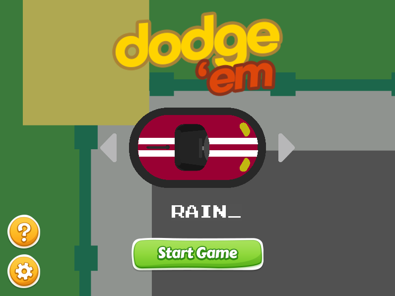

Dodge 'Em is a multiplayer game similar to the likes of Slither.io and Agar.io. The player can choose from four bumper cars and can consume power-ups to defeat the other players. The power-ups include "Fuel" for regenerating health and "NOS tank" for an additional speed boost. The players can also encounter a "Bubble Gum" obstacle that prevents their bumper cars from moving for a couple of seconds. The game also features an in-game chat that allows the players to talk with each other.

