SpryLMS is a Canadian edtech startup that allows its users to take charge of their organization's compliance and education programs. Its cloud-based learning management system addresses the key needs of the organizations and their learners.

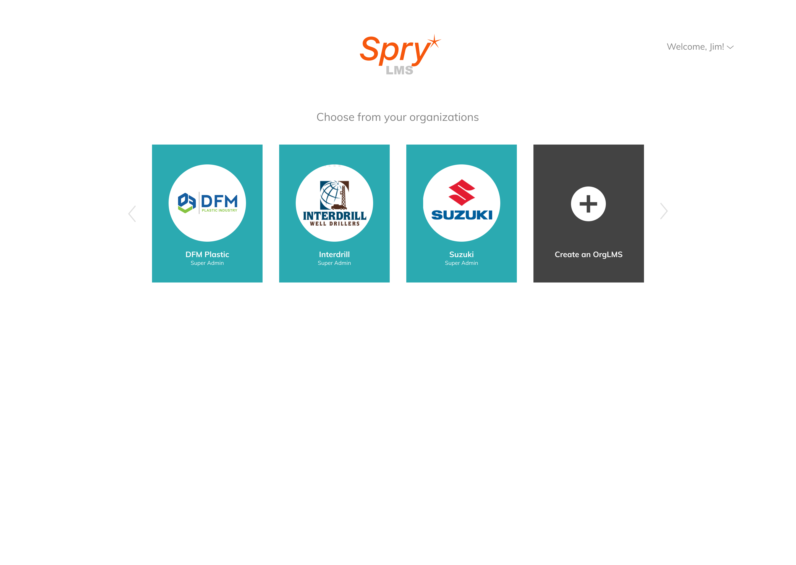
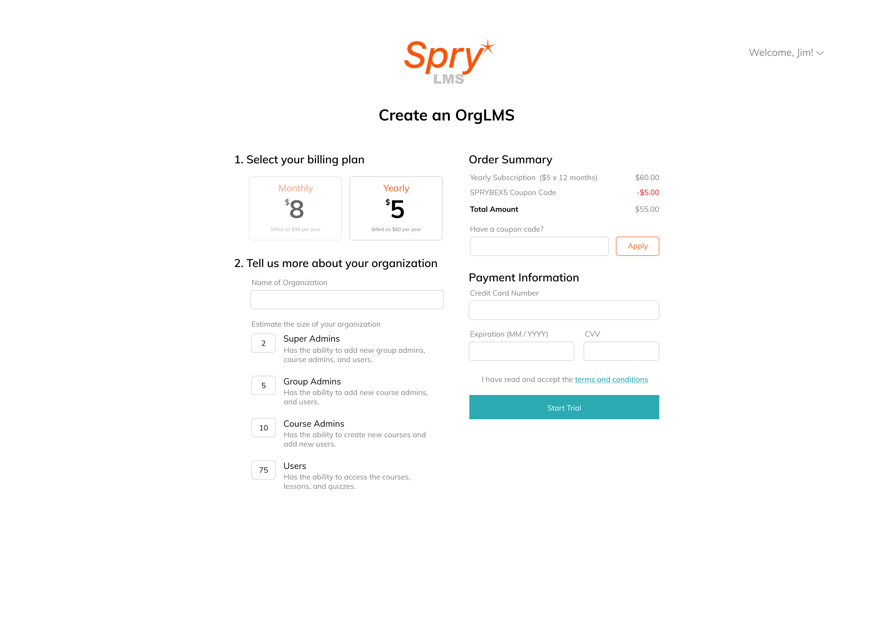
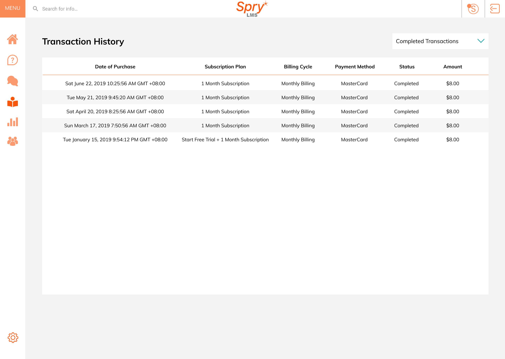
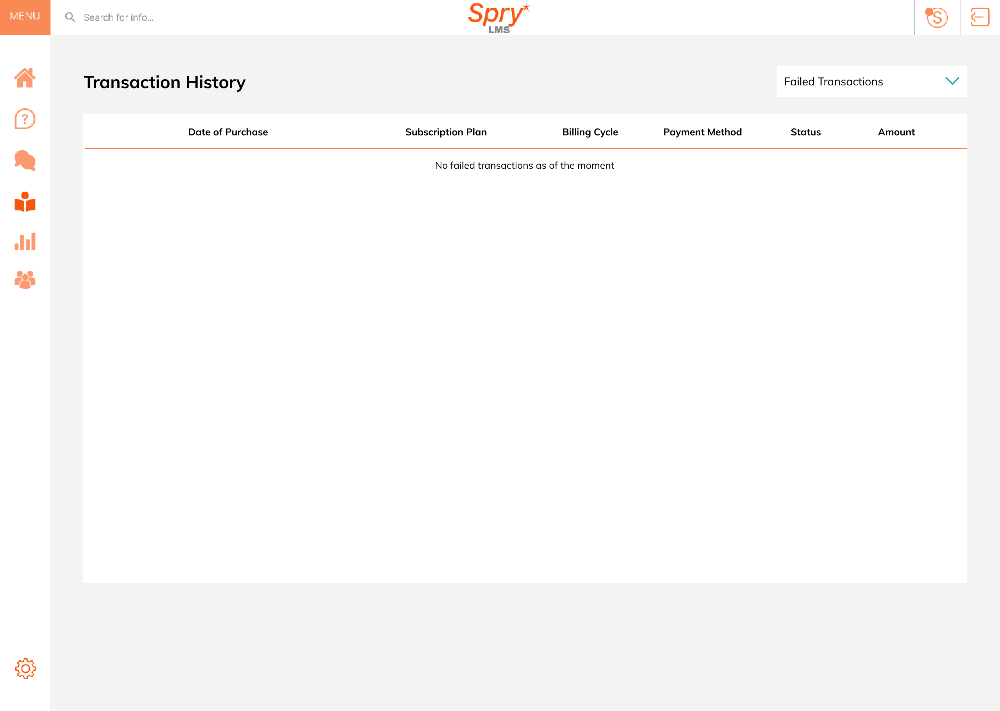
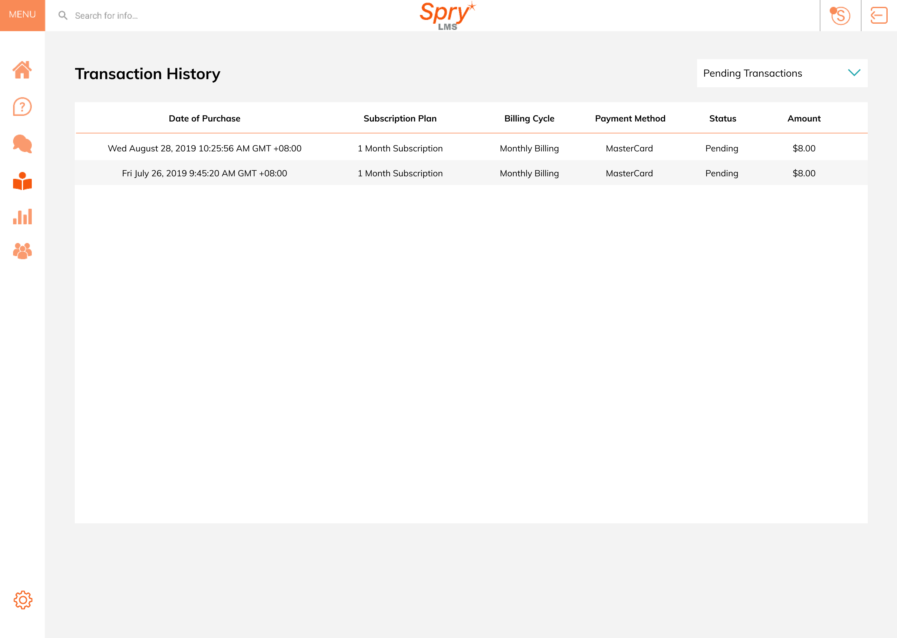
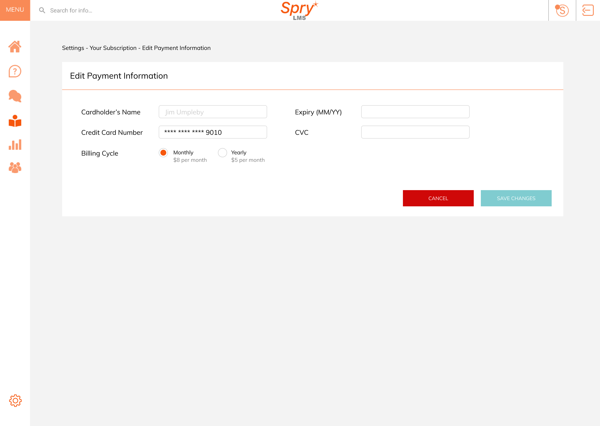
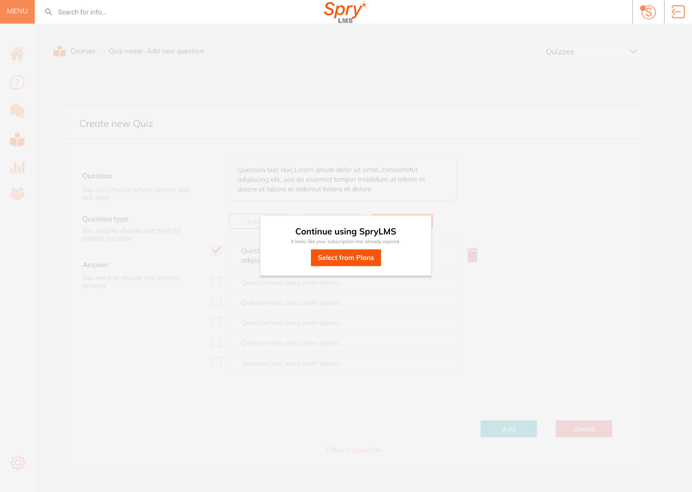
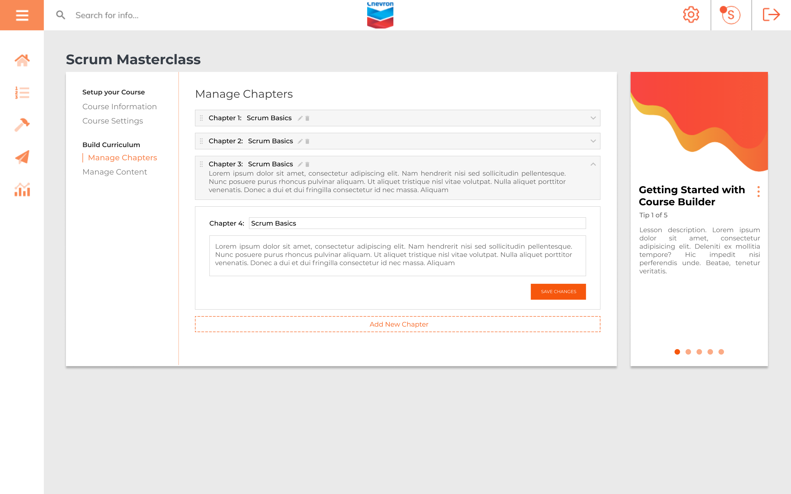
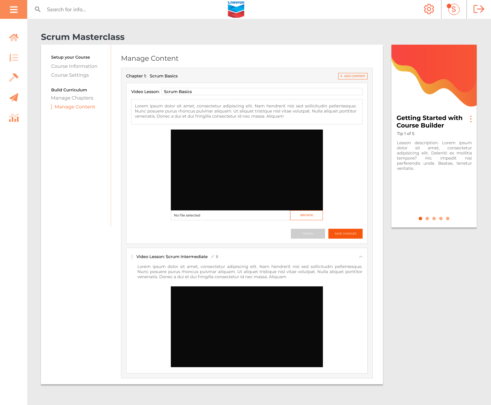
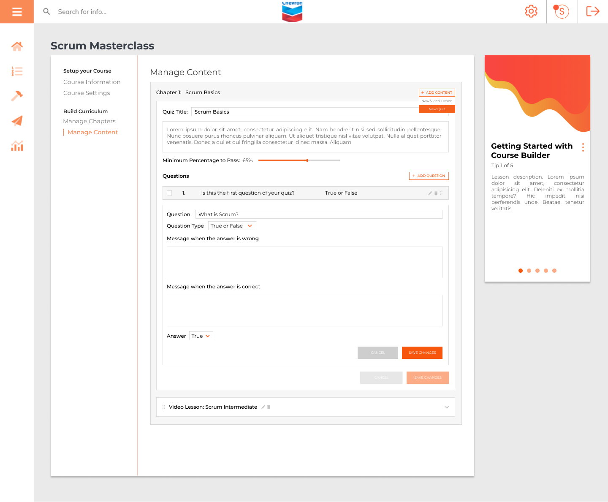
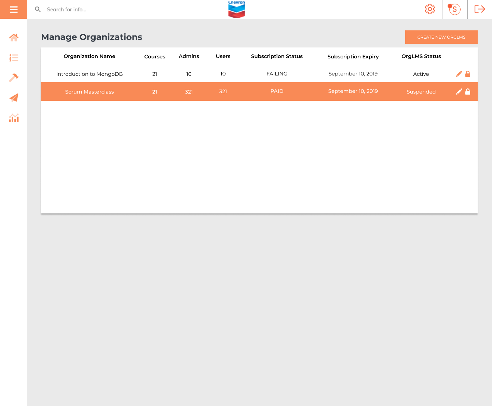
