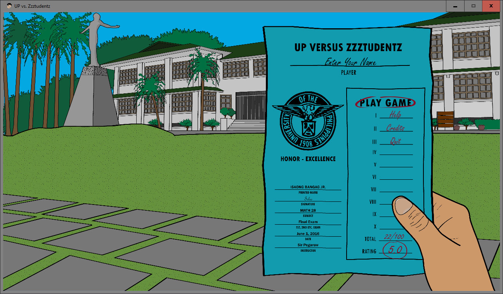
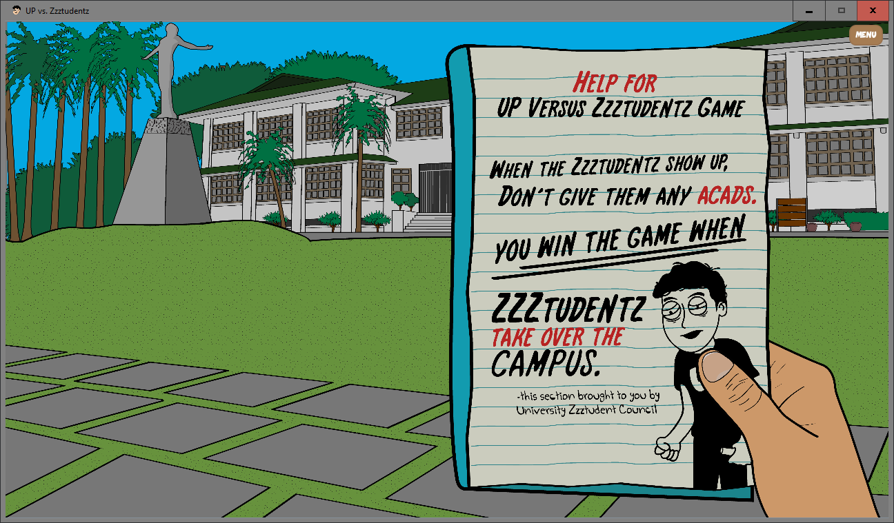
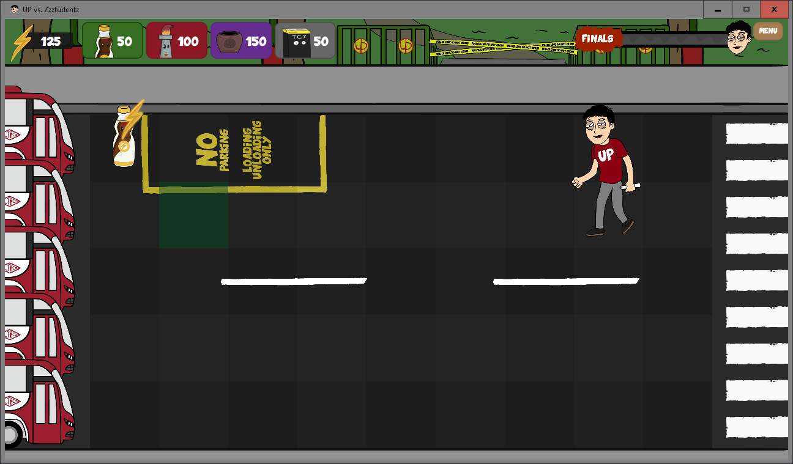
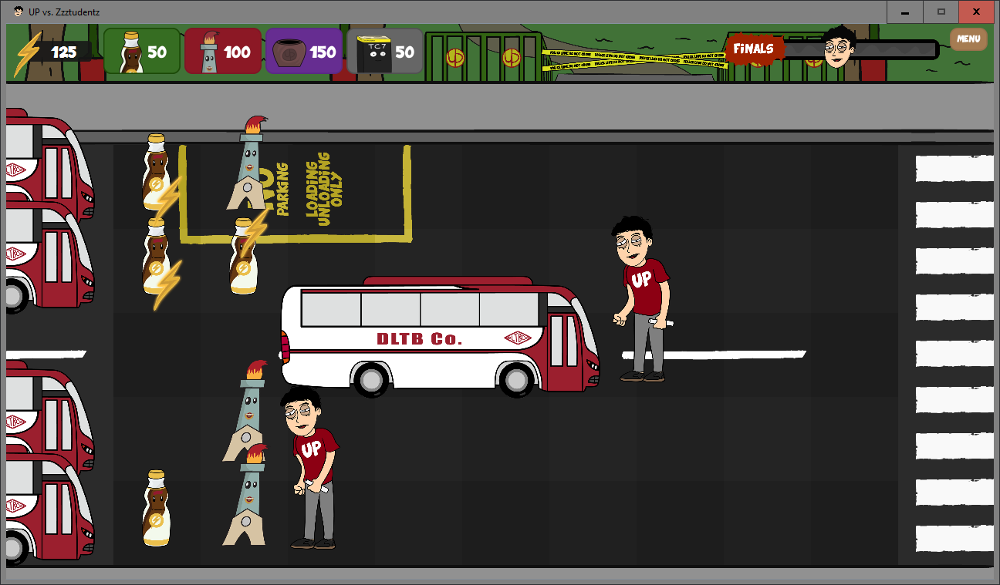
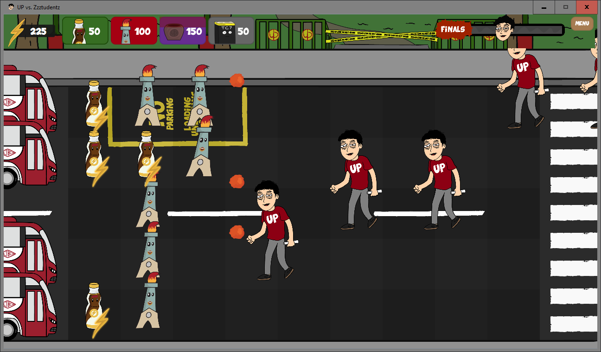
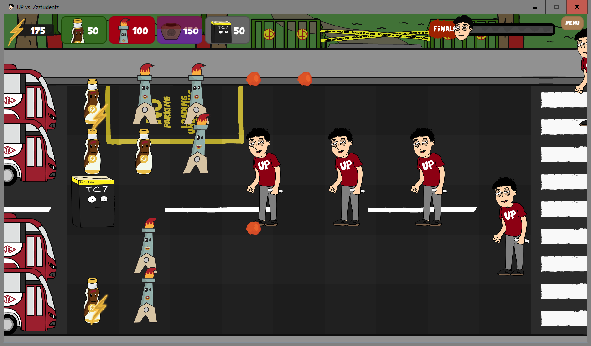
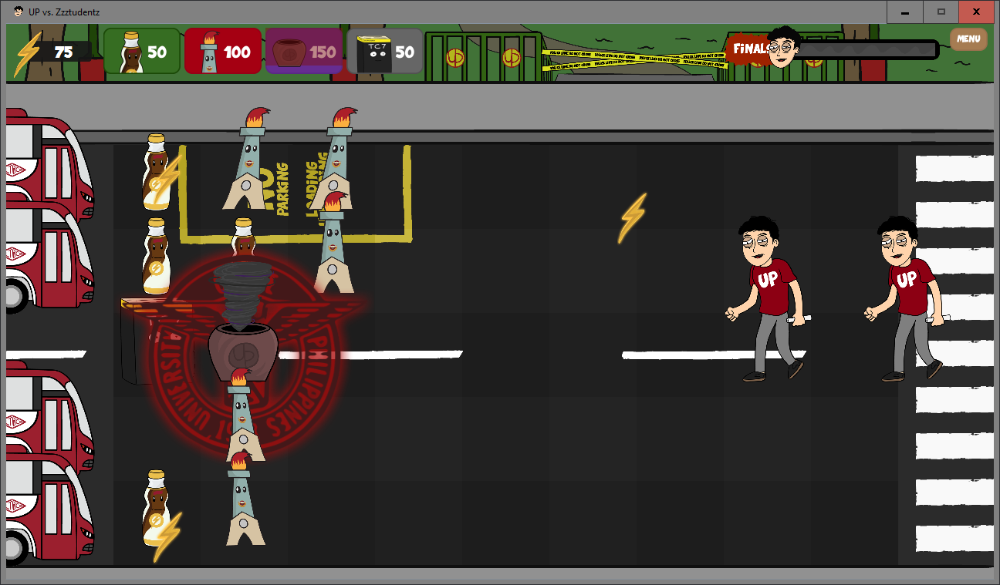
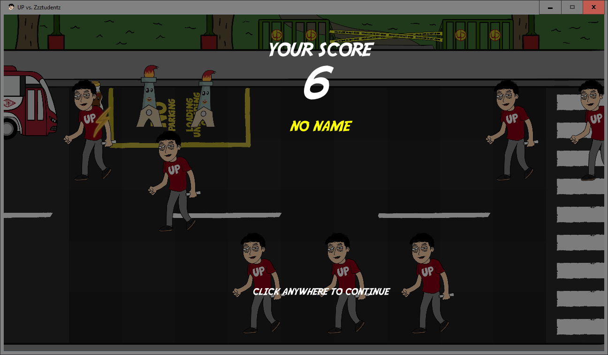

UPvZ is a Plants vs. Zombie-like Java game inspired by icons and landmarks within UPLB. The video game received the highest remark among the other coursework projects for CMSC 22 and was selected to be part of the ICS Week 2017 Exhibit.

